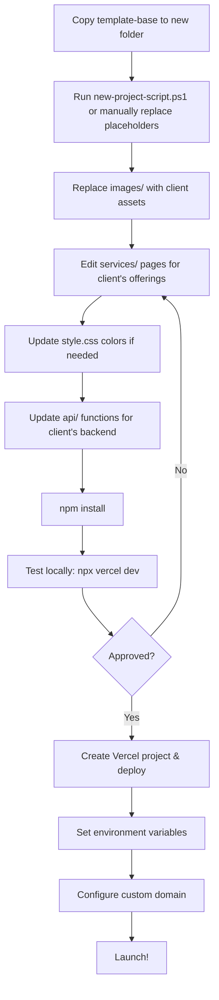

# Website Template Base

A production-ready, responsive HTML/CSS/JS website template designed for service-based businesses. Built with vanilla HTML, CSS, and JavaScript — no framework dependencies.

---

## 1. Template Structure (What Goes Where)

```
template-base/
├── index.html                      # Main homepage (edit content here)
├── style.css                       # All styles with CSS custom properties
├── app.js                          # Navigation, testimonials, FAQ accordion, animations
├── package.json                    # Node.js project config (Vercel deployment)
├── package-lock.json               # Dependency lock file (do NOT delete)
├── .gitignore                      # Git ignore rules
├── .vercelignore                   # Vercel ignore rules
├── cli-demo.js                     # CLI demo utility
├── dev-server.js                   # Local dev server
├── new-project-script.ps1          # PowerShell script to automate new projects
│
├── services/
│   ├── services.css                # Shared service page styles
│   └── service-template.html       # Copy this for each new service page
│
├── images/
│   ├── logo.svg / logo.txt         # Replace with your company logo
│   └── images-readme.txt           # Instructions for hero/service images
│
├── api/                            # Serverless API functions (Vercel)
│   ├── contact.js                  # Contact form handler
│   ├── generate.js                 # AI generation endpoint
│   ├── upload.js                   # File upload handler
│   ├── auth/                       # Authentication endpoints
│   │   ├── login.js
│   │   ├── signup.js
│   │   └── me.js
│   └── websites/                   # CMS-like website management
│       ├── index.js
│       └── [id].js
│
├── lib/
│   └── supabase.js                 # Supabase client config (update credentials)
│
├── supabase-migration.sql          # Database schema (if using Supabase)
└── supabase-storage.sql            # Storage configuration
```

## 2. Essential vs Optional Files

### MUST KEEP (core template)
| File | Purpose |
|------|---------|
| `index.html` | Main landing page |
| `style.css` | All CSS styles |
| `app.js` | All JavaScript interactions |
| `services/services.css` | Service page styles |
| `package.json` | Dependencies & project config |
| `package-lock.json` | Lock file (guarantees reproducible installs) |

### SAFE TO CHANGE (replace with your content)
| File | What to do |
|------|------------|
| `index.html` | Edit text, images, services list, testimonials |
| `images/*` | Replace with your own logo and photos |
| `services/service-template.html` | Copy, rename, fill with your content |
| `api/*` | Modify or replace with your own backend logic |
| `lib/supabase.js` | Update with your Supabase credentials |

### CAN BE REMOVED IF NOT NEEDED
| File | When to remove |
|------|----------------|
| `api/auth/*` | If you don't need authentication |
| `api/websites/*` | If you don't need a CMS |
| `api/generate.js` | If you don't need AI generation |
| `api/upload.js` | If you don't need file uploads |
| `supabase-migration.sql` | If not using Supabase |
| `supabase-storage.sql` | If not using Supabase storage |
| `cli-demo.js` | Not needed for production |
| `dev-server.js` | Not needed for Vercel deployment |

## 3. How to Use This Template

### Option A: Manual (recommended for one-time use)
1. Copy the entire `template-base/` folder
2. Rename it to your project name (e.g., `my-new-site/`)
3. Open `index.html` and replace all `@PLACEHOLDER@` values:
   - `@COMPANY_NAME@` → Your business name
   - `@PRIMARY_COLOR@` → Your brand color (e.g., `#d9360e`)
   - `@PRIMARY_COLOR_DARK@` → Darker shade of primary (e.g., `#b82e0a`)
   - `@PRIMARY_COLOR_LIGHT@` → Lighter shade of primary (e.g., `#ff4f22`)
   - `@PRIMARY_COLOR_GLOW@` → RGBA version at 15% opacity (e.g., `rgba(217, 54, 14, 0.15)`)
   - `@PHONE_NUMBER@` → Your phone/WhatsApp (e.g., `+96599977679`)
   - `@EMAIL@` → Your contact email
   - `@ADDRESS@` → Your street address
   - `@CITY@` → Your city/location
   - `@YEAR@` → Current year
   - `@HERO_TITLE@` → Main headline
   - `@HERO_SUBTEXT@` → Hero paragraph text
   - `@ABOUT_TEXT@` → About section description
4. Repeat for each `services/service-*.html` file
5. Replace images in `images/` folder
6. Run `npm install`
7. Deploy to Vercel

### Option B: Automated (PowerShell script)
```powershell
# From the project root
.\new-project-script.ps1 `
  -ProjectName "MyNewSite" `
  -CompanyName "Acme Services" `
  -PrimaryColor "#d9360e" `
  -Phone "+96599977679" `
  -Email "info@acme.com" `
  -Address "123 Main St" `
  -City "Kuwait City" `
  -HeroTitle "Premium Services in Kuwait City" `
  -HeroSubtext "Your trusted partner for quality services." `
  -AboutText "We are a professional team dedicated to excellence."
```

The script will:
- Copy the template to a new folder `MyNewSite/`
- Replace all `@PLACEHOLDER@` tokens with your values
- Output the next steps

## 4. Copy vs Clone: How to Start Each New Project

**NEVER edit the `template-base/` folder directly.** Instead:

1. **Copy the entire folder** — `Ctrl+C`, `Ctrl+V` or `cp -r template-base my-new-project`
2. This gives you a fully independent project with no links to the original
3. Edit all files in the new folder, not the template

The template is a **master copy** — always keep it pristine so you can reuse it.

## 5. Node.js, Vercel, and Dependencies

### package.json
- Will **not** work automatically after copying
- You MUST run `npm install` in the new project folder
- The `package-lock.json` ensures exact same dependency versions

### Vercel Deployment
- After copying, you need to create a NEW Vercel project:
  ```bash
  cd my-new-project
  npx vercel project add my-new-project-name
  npx vercel --prod --yes
  ```
- Environment variables (e.g., Supabase URL, API keys) must be reconfigured:
  ```bash
  npx vercel env add SUPABASE_URL
  npx vercel env add SUPABASE_ANON_KEY
  npx vercel env add OPENAI_API_KEY
  ```
- The `.vercel/project.json` file is NOT copied (you'll get a fresh one when you link)
- If you use `api/` functions, Vercel automatically detects them as serverless functions

### GitHub
- After copying, initialize a fresh git repo:
  ```bash
  cd my-new-project
  git init
  git add .
  git commit -m "Initial commit from template"
  ```
- Create a repo on GitHub and push:
  ```bash
  git remote add origin https://github.com/you/your-repo.git
  git branch -M main
  git push -u origin main
  ```

## 6. Files You MUST Copy Into Every New Project

Every new project needs ALL files from `template-base/`. The template is designed as a self-contained unit:

```
index.html
style.css
app.js
package.json
package-lock.json
.gitignore
.vercelignore
services/services.css
images/            (replace contents)
```

Service pages (`services/*.html`) are optional — only copy the ones you need and rename them.

API functions (`api/*`) are optional — only include if your project needs backend endpoints.

## 7. Folders and Files You Should NEVER Copy

These are auto-generated or environment-specific. They are NOT in the template, but ensure you never manually copy them into a new project:

| Folder/File | Why |
|-------------|-----|
| `node_modules/` | Auto-generated by `npm install` |
| `.vercel/output/` | Build artifacts from Vercel |
| `.vercel/.env.*` | Local environment variables (secrets) |
| `.vercel/project.json` | Project-specific Vercel config |
| `.git/` | Git repository data |
| `*.log` | Log files |

## 8. Step-by-Step Workflow for New Client Projects



### Detailed Steps

**1. Create project folder**
```bash
cp -r template-base my-client-project
cd my-client-project
```

**2. Configure branding**
- Edit `style.css` — set `--primary`, `--primary-dark`, `--primary-light`, `--primary-glow`
- Replace `images/logo.png` with client's logo
- Update favicon if needed

**3. Update content in `index.html`**
- Company name, tagline, hero text
- About section description
- Services list (add/remove cards)
- Testimonials
- Gallery images
- Contact info (phone, email, address, hours)
- Google Maps iframe URL
- Social media links

**4. Create service pages**
- Copy `services/service-template.html` for each service
- Rename and edit content
- Update hero background image
- Write FAQ answers
- Update related services links

**5. Install & test**
```bash
npm install
npx vercel dev
```

**6. Deploy to Vercel**
```bash
npx vercel --prod --yes
```

**7. Configure production**
```bash
npx vercel project protection disable my-project --sso
nvercel domains add myclient.com
```

---

## Reusable vs Project-Specific Analysis

### REUSABLE Across Projects (keep in template)
- **Page structure** — Navigation, hero layout, services grid, about section, gallery, testimonials, contact form, footer, WhatsApp float
- **CSS framework** — Dark theme, responsive breakpoints, animations, buttons, cards, forms, grid layouts
- **JavaScript** — Mobile menu, dropdown toggle, testimonial slider, stats counter, scroll reveal, contact form handler, FAQ accordion, hero parallax
- **Build config** — package.json, Vercel deployment, .gitignore
- **Service page layout** — Content grid, process steps, FAQ accordion, related services

### PROJECT-SPECIFIC (replace each time)
- **Text content** — Company name, headlines, descriptions, service names, about text
- **Brand colors** — CSS custom properties for primary/secondary colors
- **Images** — Logo, hero backgrounds, service cards, gallery photos
- **Service pages** — Number and type of services varies per client
- **API endpoints** — Backend logic is client-specific (contact handling, auth, database)
- **Testimonials** — Client reviews are unique
- **Social links** — Different platforms per client
- **Map embed** — Different location per client

### Minimum Template Structure
```
project-root/
├── index.html              # Homepage (mandatory)
├── style.css               # All styles (mandatory)
├── app.js                  # All JS interactions (mandatory)
├── package.json            # Dependencies (mandatory for Vercel)
└── images/                 # Logo + images (replace contents)
```

### How to Save the Most Time
1. **Keep the template clean** — Never edit `template-base/` files directly for client work
2. **Use the PowerShell script** — Automates placeholder replacement in seconds
3. **Batch image replacements** — Prepare all client images in the correct dimensions upfront
4. **Reuse the service page structure** — Just copy `service-template.html` and change text/images; the layout, FAQ accordion, and process steps are already built
5. **CSS custom properties** — Change the entire look by editing only 4 color variables in `:root`
6. **Avoid modifying `app.js`** — All JavaScript is already generic and works for any business type

The template saves approximately **80% of development time** — you only need to write content, not code structure.
